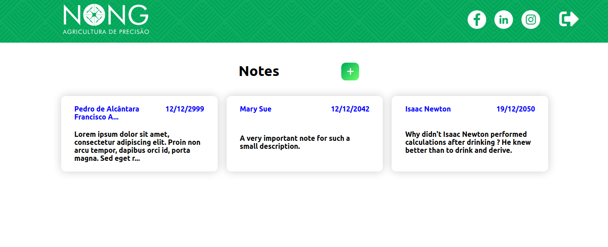
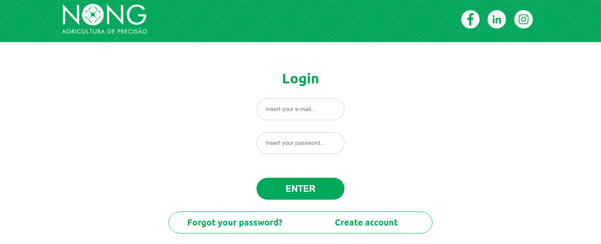

<h1 align="center">NONG Job Test</h1>
<h2 align="center">

This project was developed as a job test for NONG.</h1>

## The App
The app was built with React.js and is responsive, working in desktop, tablet and phone devices. The app illustrates an interface for creating and configuring field notes taken during crop scouting. It is very common for these notes to be taken on paper, which makes it hard to manage them. This web app helps manage these crop scouting notes by keeping them saved and ordered by date. The app authenticates the user with Firebase authentication technology, stores the notes in Cloud Firestore and is hosted by Firebase hosting. 

The app also features a login and signup pages for user registration and authentication.

Also, the app features a page for reseting the password in case the user has forgoten his/her password and a logout button.

## Technologies used
For this app, the frontend was built with React.js, while the backend is hosted and configured by Firebase and Cloud Firestore.

The site is live at https://nong-640e0.firebaseapp.com/.

## Backend routes
There are 4 routes for the backend. 
### `/login` 
Displays the login page.

### `/signup`
Displays the signup page.

### `/resetPassword`
Displays the page where the user inserts his/her e-mail address in order to reset its password.

### `/`
Redirects to the notes creation and configuration page. This page won't be displayed unless the user has signed in.

## Available Scripts

In the project directory, you can run:

### `npm start`

Runs the app in the development mode.\
Open [http://localhost:3000](http://localhost:3000) to view it in the browser.

The page will reload if you make edits.\
You will also see any lint errors in the console.

### `npm test`

Launches the test runner in the interactive watch mode.\
See the section about [running tests](https://facebook.github.io/create-react-app/docs/running-tests) for more information.

### `npm run build`

Builds the app for production to the `build` folder.\
It correctly bundles React in production mode and optimizes the build for the best performance.

The build is minified and the filenames include the hashes.\
Your app is ready to be deployed!

See the section about [deployment](https://facebook.github.io/create-react-app/docs/deployment) for more information.

### `npm run eject`

**Note: this is a one-way operation. Once you `eject`, you can’t go back!**

